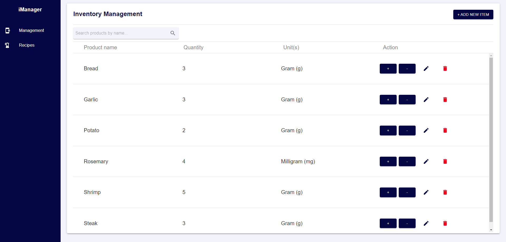
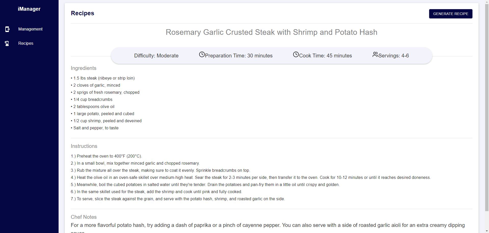

# Inventory Manager

<!-- ABOUT THE PROJECT -->
## About the Project

● A full-stack application that stores user-defined entries, each manageable via manual CRUD operations
● Integrated Llama 3 LLM via Groq API to generate recipe combinations based on documents stored in Firestore database






### Built With

* [![JavaScript][javascript.com]][JavaScript-url]
* [![CSS][css.com]][CSS-url]
* [![Firebase][firebase.com]][Firebase-url]


## Get Started

```
fnm env --use-on-cd | Out-String | Invoke-Expression
fnm use --install-if-missing 20
npm run dev
```


<!-- MARKDOWN LINKS & IMAGES -->
<!-- https://www.markdownguide.org/basic-syntax/#reference-style-links -->
[javascript.com]: https://img.shields.io/badge/logo-javascript-blue?logo=javascript
[JavaScript-url]: https://www.javascript.com/
[css.com]: https://img.shields.io/badge/logo-css-blue?logo=css
[CSS-url]: https://www.w3.org/Style/CSS/Overview.en.html
[firebase.com]: https://img.shields.io/badge/logo-firebase-orange?logo=firebase
[Firebase-url]: https://firebase.google.com/